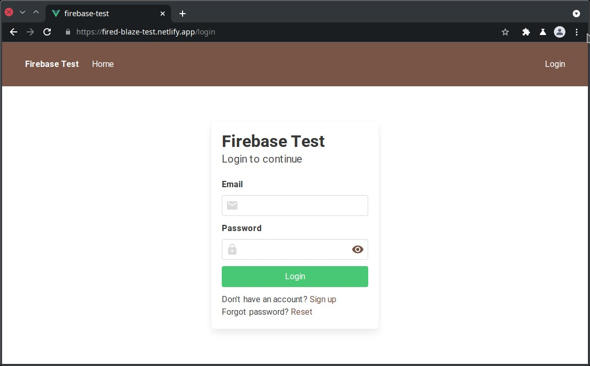

# Firabes test

A simple Firebase app with Auth & Firestore + Vue.js

Deployed to https://fired-blaze-test.netlify.app



## Project setup
```
yarn
```

### Compiles and hot-reloads for development
```
yarn serve
```

### Compiles and minifies for production
```
yarn build
```

### Customize configuration
See [Configuration Reference](https://cli.vuejs.org/config/).
